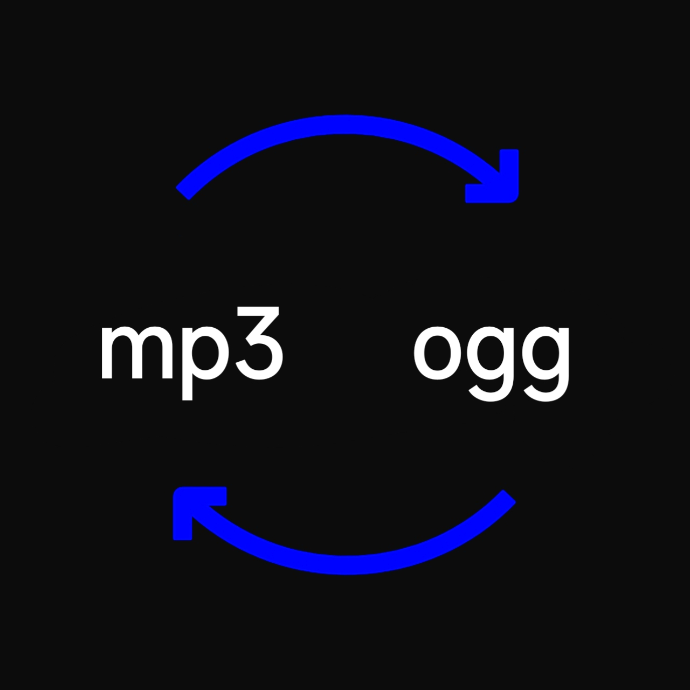

# Audio Converter



A tool for converting audio formats, supporting multiple formats via FFmpeg.

<p align="center">
  
  
  
</p>

## Supported Formats

### Audio
```
MP3, AAC, WAV, FLAC, OGG, OPUS, M4A, WMA, AC3, EAC3, DTS, TrueHD, WV, AIFF, TTA, AMR,
OGA, SPX, CAF, VOC, S16LE, S16BE, S32LE, S32BE, F32LE, F64LE, U8, ALAW, MULAW, APE, MPC,
TAK, DSF, G722, G723.1, G726, G728, G729, iLBC, aptX, aptX HD, SBC, LC3, Codec2
```
---

<p align="center">
  
  
</p>
